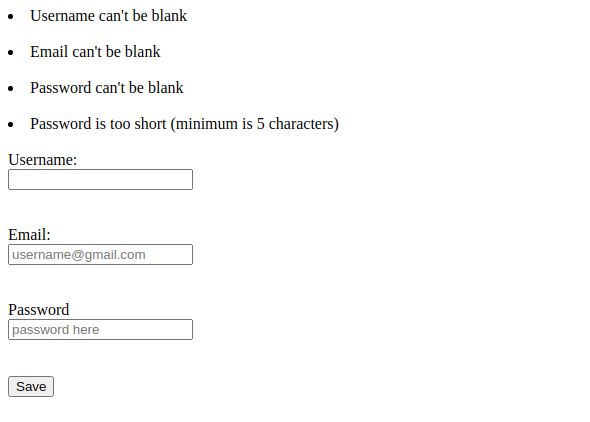

# Re-Former

>This project is a Ruby on Rails project. The exercise is based on building forms using Rails.

## Screenshot of Project:



# Getting Started
You should have Ruby & Ruby on Rails already installed on your machine before you begin.

To get a local copy of the repository please run the following commands on your terminal:

```
$ cd <folder>
```

```
$ git clone git@github.com:rahalrazika/Re-form.git
```

To install all of the ruby dependencies run the command `bundle install`

```
$ bundle install
```

To migrate the database run 'rake db:migrate' you will have to do this in order to do the next steps.

```
$ rake db:migrate
```

# Testing
To launch the rails server inside of your terminal you will need to navigate into the repository you have just cloned. You will do this by using `cd` inside of your terminal. Once you are inside of this folder run the command `rails server` and this start the webrick server. 

Below shows the following commands you will need to run to achieve this:

```
$ cd Re-form
```

```
$ rails server
```

Next you will want to open up your browser and navigate to `https://localhost:3000/users/new` this is where you will be able to create a new user. To then edit the user you have just created you will need to navigate to `https://localhost:3000/users/1/edit`.

Visit these two destinations in your browser to create new users and edit existing users (You can change the value of 1 to whatever value you wish, this value corresponds to the User ID).
```
$ https://localhost:3000/users/new
```

```
$ https://localhost:3000/users/1/edit
```

## Built With

- Ruby (Version - 2.7.0)
- Ruby on Rails 5.2.4.3


## Authors

👤 **Jacob Rees**

- Github: [@jacobrees](https://github.com/jacobrees)
- Linkedin: [jacob-rees-a6507b1a6](https://www.linkedin.com/in/jacob-rees-a6507b1a6/)


👤 **Razika Rahal**

- Github: [@rahalrazika](https://github.com/rahalrazika)
- Linkedin : [Razika Rahal](https://www.linkedin.com/in/razika-rahal-85539bbb/)
- Twitter: [@RereRere055](https://twitter.com/RereRere055)


## 🤝 Contributing

Contributions, issues and feature requests are welcome!

## Show your support

Give a ⭐️ if you like this project!

## Acknowledgments

- Project inspired by Microverse Program
